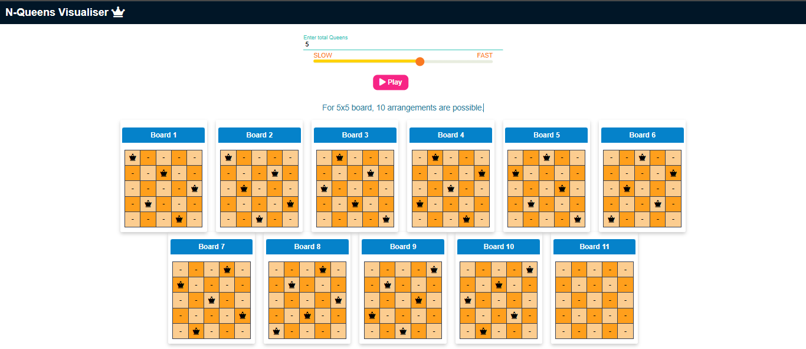

---

# **Nqueen Problem Visualizer**

This project visualizes the N Queen Problem using HTML, CSS, and JavaScript. The application leverages recursion and backtracking algorithms to provide an interactive visualization.

### **Technology Used**
- **Frontend**: Built using **HTML**, **CSS**, and **JavaScript** for a lightweight and responsive experience.
- **Algorithm Visualization**: Implemented recursion and backtracking algorithms to solve the N Queen problem, with `async/await` functions enabling smooth, step-by-step visualization.
- **Dynamic Step-by-Step Display**: Each move is rendered in real time, helping users clearly understand the algorithm's process as it unfolds.
- **User Engagement**: Enhanced user experience by providing a clear and interactive representation of the algorithm in action.

### **Project Files**

1. **index.html**  
   

2. **home.html**  
   

--- 

